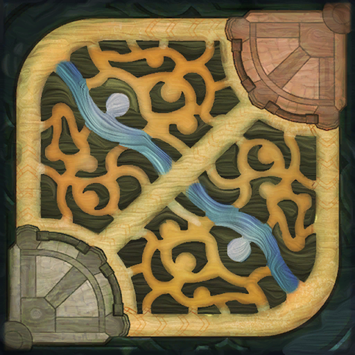

# Lol-Playstyle-Analysis
Performed time-series clustering analysis to see if there are common strategies in the game League of Legends divided per role

1. Obtained data through Riot's API for a matches' timeline. Each timeline is obtained in dictionary format where each event is given information such as frame(1 min intervales), event, timestamp, participants, and position.
2. Filter the timeline dataframe for the desired events and positions of a player by roles.
3. Calculate the distance between each event and the position of where I believe the player should be to have impact on the teams' effectivness to win the game. The distance was calculated with the euclidean method.

  The map is on a grid of x:14870, y:14980

4. Create the time series of the player distance from designated position throughout the duration of the game.
5. Perform Hierarchical Agglomerative Clustering to perform group all the time series of a single role into similar positional playstyles over a match.
6. Display and interpret the resulting clusters(results below is for a top lane role)
    Examples of interpretation: The first image shows that the player had a time period where they would play their lane, but then swap to the other side of the map. This is likely due to the player taking the tower and requested to swap lanes to the other side of the map. A bit after the middle of the game, the player focuses more on the middle map likely due to the team deciding to group together to push together and try to push for the win. 

